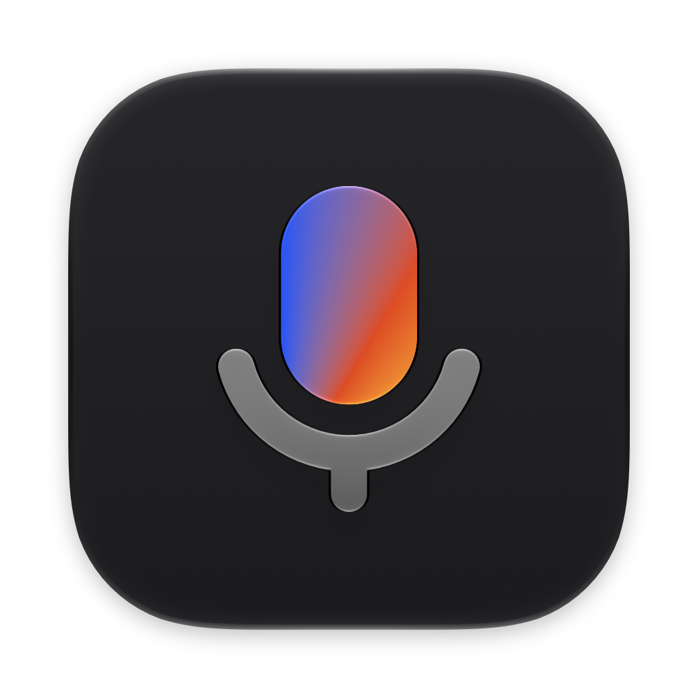

<p align="center">
  
</p>

<h1 align="center">Tony</h1>

<p align="center">
  <b>Hold a key. Speak. Let go.</b><br>
  Your words land where the cursor is, in any app, the moment you release.<br>
  Free and open source dictation for the Mac. On device, private, and fast.
</p>

<p align="center">
  <a href="https://github.com/bestboyhq/tony/releases/latest"></a>
</p>

<p align="center">
  <a href="https://github.com/bestboyhq/tony/releases/latest"></a>
  
  
  <a href="LICENSE"></a>
</p>

---

Typing is slow, and most dictation is worse.
Cloud apps wait on a server, local ones on a heavier model, and many clip your first word, paste a "Thank you." you never said, or wipe your clipboard.
Tony starts listening the instant your key goes down, transcribes on your Mac's Neural Engine with one of the most accurate open speech models there is, and types the result into whatever app you are in.
A sentence takes about 50 ms.
Your voice never leaves the Mac.

## Fast

| You speak for | Tony transcribes it in |
| --- | --- |
| 5 seconds | **49 ms** |
| 13 seconds | **70 ms** |
| 26 seconds | **147 ms** |

<sub>Parakeet Ultra on the Neural Engine of a MacBook Pro with M5 Pro, median of 5 runs.
  The clips were read by a macOS voice, and every one came out word for word.</sub>

- **Your first word counts.** The audio engine stays prepared between dictations, so capture starts on key down, not a beat later.
- **Warm from the first press.** The model loads at launch and pays its Neural Engine setup up front, so the first dictation of the day is as quick as the hundredth.
- **Talk for five minutes, wait for none.** Past half a minute, Tony transcribes in the background at each pause while you keep talking, so letting go is as instant after a long ramble as after one sentence.
- **Idle is free.** Between dictations the mic is closed, so no orange dot, and the CPU rests.

## Accurate

Tony runs Parakeet Ultra: NVIDIA's Parakeet TDT v3, post-trained by Moondream to make fewer errors on every benchmark they report.

| Model | English word error rate | Parameters |
| --- | --- | --- |
| Whisper large-v3 | 7.44% | 1.55 B |
| Parakeet TDT v3 | 6.26% | 0.6 B |
| **Parakeet Ultra, in Tony** | **5.80%** | **0.6 B** |

<sub>Lower is better. Averages over the <a href="https://huggingface.co/spaces/hf-audio/open_asr_leaderboard">Open ASR Leaderboard</a> English sets: Parakeet from <a href="https://huggingface.co/moondream/parakeet-ultra">Moondream's model card</a>, Whisper from the <a href="https://arxiv.org/abs/2510.06961">leaderboard paper</a>.</sub>

Across 25 languages (FLEURS), Ultra cuts the error rate from 11.6% to 9.6%, and in background noise from 6.7% to 5.8%.

- **25 languages, detected as you speak.** English, German, French, Spanish, Italian, Portuguese, Dutch, Polish, Ukrainian, Russian, Greek, and the rest of Europe.
  Switch between them without touching a setting.
- **Punctuation and capitals included.** The model writes them, so the text reads like you typed it.
- **No "um".** Filler words come out in every language Tony speaks, and the sentence around them keeps its commas and capitals.
- **Fits the cursor.** Tony reads the text before the cursor: a space after a word, none after an opening bracket, and no capital in the middle of a sentence.
- **Silence types nothing.** Voice activity detection trims the quiet, so a cough or a quiet room never turns into a phantom sentence.

## Beautiful

Tony is a menu bar icon and one small glass pill.
It is most of what you will ever see of Tony, so it gets the attention.

- **A pill, not a window.** It floats at the bottom of your screen, over full-screen apps and on every Space, in Liquid Glass on macOS 26 and native vibrancy before.
- **Alive at 120 Hz.** A level meter follows your voice every frame on ProMotion, and the pill springs in and out the way macOS moves.
- **Never in the way.** It never takes focus or a click from the app beneath it, so your text always lands where you were typing.
- **Hover the dot.** Its blue-to-orange gradient comes alight and churns until the pointer leaves.
- **Plays by your settings.** Light and dark, Reduce Motion, Reduce Transparency, Increase Contrast, and VoiceOver announcements.

## Works everywhere

- **Every app.** Native apps, Safari and Chrome, Slack and VS Code, Terminal: if it takes paste, it takes Tony.
- **Every layout.** QWERTY, Dvorak, and Cyrillic layouts all paste correctly.
- **Your clipboard stays yours.** Tony pastes through it, then puts back everything it held: text, images, files.
  Copy something in the meantime and yours wins.
  Clipboard managers skip dictations.
- **Every word survives.** A password field or an app that refuses paste gets a Copy button in the pill, and your last dictation waits in the menu to paste again.
- **Undo is one ⌘Z.** A dictation lands as a single paste.
- **Problems in plain words.** A closed lid, a muted mic, or an unplugged headset gets one plain sentence and, where it helps, a button that fixes it.
- **Your AirPods keep sounding good.** Tony prefers the built-in mic, since opening an AirPods mic drops your music to phone-call quality.

## Private

Audio and text stay on your Mac, and audio stays in memory: it is never written to disk.
There is no account and no telemetry.
Tony goes online only to download the speech model once (about 600 MB) and to check for updates.

## Use it

| Key | |
| --- | --- |
| Hold **fn** | Dictate, and let go to type it |
| Double-tap **fn** | Hands-free: talk as long as you like, tap again to finish |
| **Esc** | Cancel, nothing is typed |

Prefer another key?
Pick right ⌥, right ⌘, or any modifier in Settings.
When fn is your key, Tony offers to stop it from also opening the emoji picker.

Settings has three choices: the key, the mic, and the language.
Those are where people really differ.
Everything else is a tuned default.

## Install

1. [Download Tony](https://github.com/bestboyhq/tony/releases/latest), open the disk image, and drag Tony to Applications.
2. Open it.
   Tony asks for the microphone and Accessibility, one at a time, while the speech model downloads.
3. Hold fn and say something into the practice field.
   That's it.

Tony lives in the menu bar, opens at login, and updates itself.
It needs macOS 15 or later on Apple silicon.

## Under the hood

```
fn down → event tap → AVAudioEngine, 16 kHz → Silero VAD → Parakeet Ultra on the Neural Engine → ⌘V → clipboard restored
```

- Native Swift 6 with SwiftUI, and AppKit for the status item, the non-activating pill, and the event tap.
- Two dependencies: [FluidAudio](https://github.com/FluidInference/FluidAudio) runs the models through Core ML, and [Sparkle](https://sparkle-project.org) handles updates.
- Swift Package Manager only, no Xcode project.
  A script assembles, signs, and notarizes the app.

## Build from source

You need macOS 15 or later on Apple silicon, Xcode 26, and Node 24.

```sh
git clone https://github.com/bestboyhq/tony && cd tony
node scripts/package.ts --debug && open release/Tony.app
```

Run the tests with `swift test` and `node --test 'scripts/*.test.ts'`.

## Contributing

Issues and pull requests are welcome.
Read [AGENTS.md](AGENTS.md) for the invariants and the code style, and the skill in [`.agents/skills/`](.agents/skills) for the area you touch: each one lists what dictation apps in that area usually get wrong.
Pull request titles follow [Conventional Commits](https://www.conventionalcommits.org), and every merged `feat` or `fix` ships to users as an in-app update.

## Credits

- [Parakeet TDT 0.6B v3](https://huggingface.co/nvidia/parakeet-tdt-0.6b-v3) by NVIDIA, post-trained as [Parakeet Ultra](https://huggingface.co/moondream/parakeet-ultra) by Moondream, [CC BY 4.0](https://creativecommons.org/licenses/by/4.0/)
- [Silero VAD](https://github.com/snakers4/silero-vad) by Silero Team, MIT
- [FluidAudio](https://github.com/FluidInference/FluidAudio) by FluidInference, Apache 2.0
- [Sparkle](https://sparkle-project.org), MIT

Tony is a sibling of [Grip](https://github.com/bestboyhq/grip), the free and open source screen recorder.

## License

[AGPL-3.0](LICENSE)
